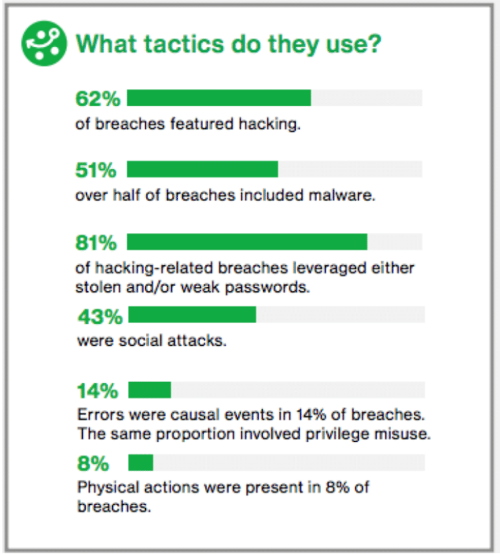
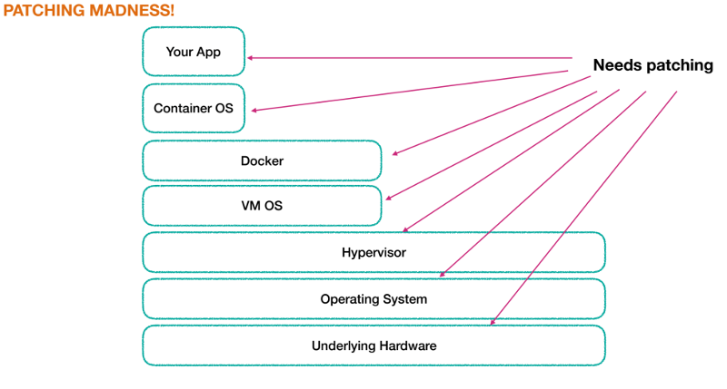

# About

This is a slide deck presenting [Tim](mailto:t.steffens@tarent.de)s key learnings from goto conference 2018 Berlin:

* slides: <https://tmstff.github.io/2018-goto-key-learnings/index.html>
* source: <https://github.com/tmstff/2018-goto-key-learnings>

to run locally use any of these: <https://gist.github.com/willurd/5720255>

e.g.

```
$ python -m SimpleHTTPServer 8000
```

# Key Learnings goto 2018 Berlin
* Kleiner Überblick über die coolsten Talks
* Einiges Talks findet man auf dem [goto YouTube Channel](https://www.youtube.com/channel/UCs_tLP3AiwYKwdUHpltJPuA)
    * Auch ältere, z.B: Martin Fowler Talks:
        * <https://www.youtube.com/results?search_query=fowler+goto>
        * z.B.: [Coding Monkeys](https://www.youtube.com/watch?v=4E3xfR6IBII)
* Goto Play App (noch mehr Videos von Talks)
    * [Android](https://play.google.com/store/apps/details?id=com.gotoplay)
    * [IOS](https://itunes.apple.com/us/app/goto-play/id1216616835)


# Your Superpower User Manual
* Marc Cohen / Google ([Slides / Infos / Video](https://gotober.com/2018/sessions/551))
* Internet archive 
    * <https://httparchive.org/>
    * [Getting Started Http Archive Big Query](https://github.com/HTTPArchive/httparchive.org/blob/master/docs/gettingstarted_bigquery.md)
    * <https://console.cloud.google.com/bigquery?p=httparchive>
* GH archive
    * <https://www.gharchive.org/>
    * <https://www.gharchive.org/#bigquery>
    * <https://bigquery.cloud.google.com/table/githubarchive:day.20150101>
* Jupyter bei Google:
    * [Google Colaboratory](https://colab.research.google.com/notebooks/welcome.ipynb)
    * Tensor Flow & Github integration

# How Software can be Thought of ...
* ... as a Force for Good ([Talk Infos](https://gotober.com/2018/sessions/654))
* Francesco Mondora (CEO Mondora)
* Italienische Firma
* "We encourage our **customers** to think about how they are **impacting society** and the **environment** and in what way they can contribute to bringing about **positive change** in the world."
    * z.B. CO2 Reduktion durch Digitalisierung von Papierlastigen Prozessen
    * "'benefit discount': if a customer can prove they are having a positive impact, we cut the price."
* Nachhaltigkeitszertifizierung - <https://bcorporation.net/about-b-corps>
* [Mondora's Blog](https://bcalmbcorp.com/)
    * [Using Software as a force for good](https://bcalmbcorp.com/using-software-as-a-force-for-good-dc84fd6403b0)
* => Video anschauen in goto Play App (Englisch etwas schwierig)

# Insecure Transit - Microservice #1
* Sam Newman - Author of "Building Microservices" [talk-infos](https://gotober.com/2018/sessions/523) - [Talk auf Youtube](https://www.youtube.com/watch?v=1sjqHlLuRw8&list=PLEx5khR4g7PIEfXSB9bDS4lB-J9stOynD&index=2)

* [HOW DO  BREACHES  OCCUR?](http://www.verizonenterprise.com/verizon-insights-lab/dbir/2017/)
    

# Insecure Transit - Microservice #2
* Single worst problem: Weak or stolen passwords
    * Password Manager einsetzen
    * Vaults für Serverseitige Passwörter einsetzen
    * Hash & Salt für Kundepasswörter
    * Keys & CAs
    * ... (siehe Video)

# Insecure Transit - Microservice #3
* “44  percent  of  security  breaches  occur  after  vulnerabilities  and  solutions  have  been  identified.  In  other  words,  the  problems  could  have  been  avoided  if  found  vulnerabilities  had  been  addressed  sooner.”
* [Equifax Breach](https://www.moneysavingexpert.com/news/protect/2017/09/massive-equifax-data-breach---what-you-need-to-know)
    * ~ deutscher Schufa
    * "143 million consumers [...] affected"
    * "social security numbers", "credit card numbers"

# Insecure Transit - Microservice #4


# Insecure Transit - Microservice #3
* Patching Madness:
    * Kubernetes &  IAAS: patchen wird einem abgenommen!
    * Check container: <https://github.com/coreos/clair>
    * Find outdated dependencies: <https://snyk.io/>
    * Commercial check-as-a-service: <https://www.aquasec.com/>

# Swearing, Nudity and Other ... #1
* ... Vulnerable Positions
* John Le Drew - Engineer & Agile Coach ([talk infos](https://gotober.com/2018/sessions/497) / [youtube](https://www.youtube.com/watch?v=ofBv-num0lA&index=4&list=PLEx5khR4g7PJquVHXtkcdo-QzK54bfmY9))
* Psychological safety: belief that one will **not be punished or humiliated** for speaking up with **ideas, questions, concern or mistakes**
* "Psychological safety was far and away the most important of the five dynamics we found"
    * ask for help without judgement on competence
    * ask for goal without sounding like the only one out of loop
    * raise red flag without being judged

# Swearing, Nudity and Other ... #2
* How to achieve that?
    * Mindfulness
        * Paying attention is about noticing how you feel, how people around you are feeling and approaching people and the organisation with curiosity and not judgement.
    * Yes, and ...  instead of "yes, but"
        * -> go with the idea, improvise, leave room for creativity
    * Are you OK? -> replace judgent with curiosity
* Google Aristotle:
    * <https://rework.withgoogle.com/blog/five-keys-to-a-successful-google-team/>
    * <https://rework.withgoogle.com/guides/understanding-team-effectiveness/steps/foster-psychological-safety/>
    * <https://www.nytimes.com/2016/02/28/magazine/what-google-learned-from-its-quest-to-build-the-perfect-team.html>

#The Leprechauns of Software Engineering
* Laurent Bossavit - [talk infos](https://gotober.com/2018/sessions/565)
* fact-check
    * research
    * ask
    * measure
    * look up sources
* sci-hub
    * Scientific knowledge should be free
    * <https://de.wikipedia.org/wiki/Sci-Hub>
    * <http://sci-hub.tech/>

# Debugging in Kubernetes
* "Troubleshooting & Debugging Microservices in Kubernetes"
* Ray Tsang & Robert Kubis - Google - [talk info & video](https://gotober.com/2018/sessions/682)
* Logs durchsuchen: Google BigQuery
* Kommando auf Container ausprobieren: `kubectl exec ...`
* Direkt auf einzelnen Container Port zugreifen: `kubectl port-forward ...`
* native monitoring, logging and error reporting: [Stackdriver Trace](https://cloud.google.com/trace/)
* Debugging: [Stackdriver Debugger](https://cloud.google.com/debugger/)
* => Video anschauen

# Service Mesh
* "A service mesh is a dedicated infrastructure layer for handling service-to-service communication"
* <https://blog.buoyant.io/2017/04/25/whats-a-service-mesh-and-why-do-i-need-one/>
* Service Discovery
* Authentication
* Load Balancing
* Circuit Breaker
* Tracing (?)
* etc.

# Energy and Education Access ...
* ... for Remote Communities
* Jaideep Bansal - Energy Access Leader at Global Himalayan Expedition ([talk info](https://gotober.com/2018/sessions/539) / [Video](https://www.youtube.com/watch?v=AwS42muvKQ0&feature=youtu.be&list=PLEx5khR4g7PJW7u0GKxRPIQddtu69boT3))
* LED Licht & Solar Panels für Enlegene Dörfer im Himalaya
    * CO2-Reduktion
    * Lebensqualität
    * Bildung => Lebensgrundlage
    * Verhinderung von Landflucht => Erhalt von Kultur & nachhaltiger Lebensweise
    * Finanzierung durch Touristen-Trekking
* Expiditionen: <http://ghe.co.in/>

